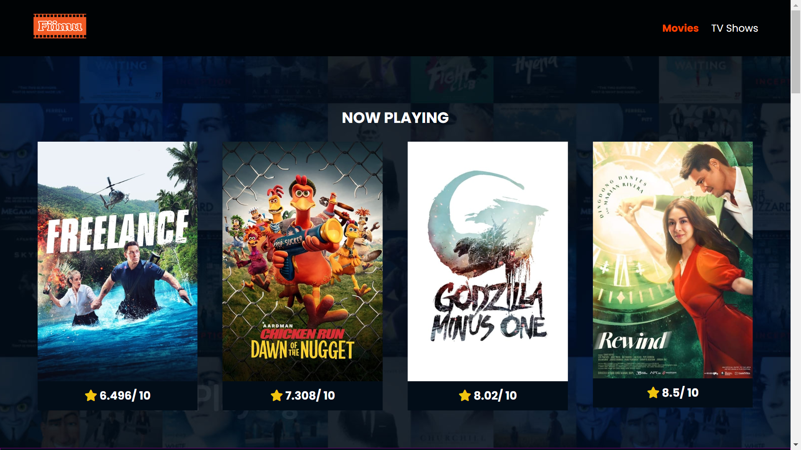
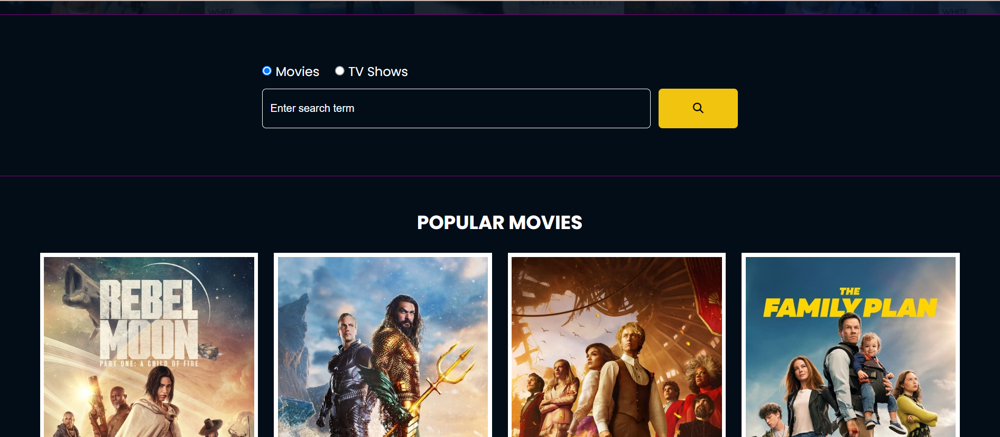
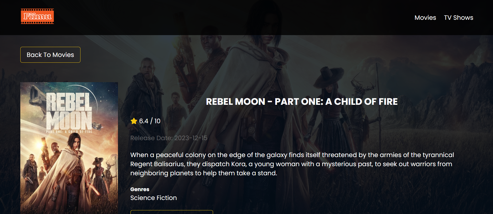
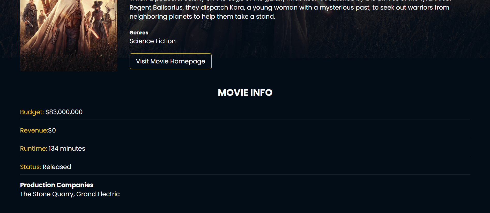

# Fiimu

Fiimu - Your Go-To Destination for the Latest Movies
Welcome to Fiimu, your one-stop destination for discovering and exploring the latest movies. Fiimu is a dynamic website built with HTML, CSS, and JavaScript that utilizes the Movie Database (TMDb) API to fetch up-to-date information about movies. Whether you're a cinephile or just looking for the next film to watch, Fiimu has got you covered.

## Features

- Latest Movies: Stay in the loop with the most recent movie releases.
- Detailed Information: Get comprehensive details about each movie, including its synopsis, release date, and ratings.
- Dynamic UI: Enjoy a user-friendly and visually appealing interface for a seamless browsing experience.

## Technologies Used

- **HTML**: Structuring the content of the website.
- **CSS**: Styling the website to create an attractive and responsive design.
- **JavaScript**: Enhancing interactivity and making API calls to fetch movie data.
- **The Movie Database (TMDb) API**: Accessing a vast database of movies for up-to-date information.

Browse the latest movies, click on them to get more details, and discover your next cinematic adventure.

[ Live project @ https://fiimu.netlify.app/](https://fiimu.netlify.app/)

## Contributing

If you would like to contribute to Fiimu, feel free to fork the repository and submit a pull request. Your contributions are highly welcome!

Thank you for exploring Fiimu! If you have any suggestions or feedback, feel free to reach out. Happy movie watching! 🎬🍿
